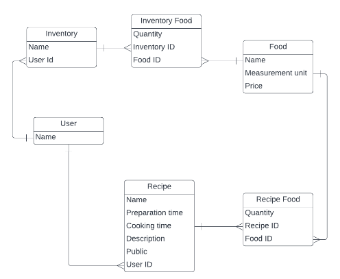

<a name="readme-top"></a>

<div align="center">

  <h3><b>Recipe App</b></h3>

  

</div>


# 📗 Table of Contents

- [📖 About the Project](#about-project)
  - [🛠 Built With](#built-with)
    - [Tech Stack](#tech-stack)
    - [Key Features](#key-features)
  - [🚀 Live Demo](#live-demo)
- [💻 Getting Started](#getting-started)
  - [Prerequisites](#prerequisites)
  - [Setup](#setup)
  - [Install](#install)
  - [Usage](#usage)
  - [Run tests](#run-tests)
  - [Deployment](#deployment)
- [👥 Authors](#authors)
- [🔭 Future Features](#future-features)
- [🤝 Contributing](#contributing)
- [⭐️ Show your support](#support)
- [🙏 Acknowledgements](#acknowledgements)
- [❓ FAQ (OPTIONAL)](#faq)
- [📝 License](#license)


# 📖 [Recipe App] <a name="about-project"></a>

> Describe your project in 1 or 2 sentences.

**[Recipe App]** is a ruby on rails ruby on rails app that keeps track of all your recipes, ingredients, and inventory. It will allow you to save ingredients, keep track of what you have, create recipes, and generate a shopping list based on what you have and what you are missing from a recipe. Also, since sharing recipes is an important part of cooking the app should allow you to make them public so anyone can access them.

## 🛠 Built With <a name="built-with"></a>

### Tech Stack <a name="tech-stack"></a>

> Describe the tech stack and include only the relevant sections that apply to your project.

<details>
  <summary>Client</summary>
  <ul>
    <li><a href="https://rubyonrails.org/">Ruby on Rails</a></li>
  </ul>
</details>

<details>
  <summary>Server</summary>
  <ul>
    <li><a href="https://rubyonrails.org/">Ruby on Rails</a></li>
  </ul>
</details>

<details>
<summary>Database</summary>
  <ul>
    <li><a href="https://www.postgresql.org/">PostgreSQL</a></li>
  </ul>
</details>

### Key Features <a name="key-features"></a>

> Describe between 1-3 key features of the application.

- **[Authentication and Authorisation]**
- **[Create, Read, Delete]**
- **[Validations]**

<p align="right">(<a href="#readme-top">back to top</a>)</p>

## 🚀 Live Demo <a name="live-demo"></a>

> Add a link to your deployed project.

- [Live Demo Link]('https://food-recipe-sa95.onrender.com')

<p align="right">(<a href="#readme-top">back to top</a>)</p>

## 💻 Getting Started <a name="getting-started"></a>

> Describe how a new developer could make use of your project.

To get a local copy up and running, follow these steps.

### Prerequisites

In order to run this project you need:

- A browser of your choice e.g Google chrome
- A text editor of your choice e.g. Visual Studio Code
- Install ruby gem and dependencies
- Install Postgresql

### Setup

Clone this repository to your desired folder:

 - cd food_recipe
 - git clone https://github.com/FrankMugagga/food_recipe.git


### Install

Install this project with:

  - cd food_recipe
  - gem install


### Usage

To run the project, execute the following command:


  rails s

### Run tests

To run tests, run the following command:

rspec

### Deployment

You can deploy this project using:

<!--
Example:

```sh

```
 -->

<p align="right">(<a href="#readme-top">back to top</a>)</p>


## 👥 Authors <a name="authors"></a>

> Mention all of the collaborators of this project.

👤 **Frank Mugagga**

- GitHub: [@githubhandle](https://github.com/FrankMugagga)
- Twitter: [@twitterhandle](https://twitter.com/@mugagga_frank)
- LinkedIn: [LinkedIn](https://www.linkedin.com/in/frank-mugagga)

<p align="right">(<a href="#readme-top">back to top</a>)</p>

<!-- FUTURE FEATURES -->

## 🔭 Future Features <a name="future-features"></a>

> Describe 1 - 3 features you will add to the project.

- [ ] **[Edit]**

<p align="right">(<a href="#readme-top">back to top</a>)</p>

<!-- CONTRIBUTING -->

## 🤝 Contributing <a name="contributing"></a>

Contributions, issues, and feature requests are welcome!

Feel free to check the [issues page](https://github.com/FrankMugagga/food_recipe/issues).

<p align="right">(<a href="#readme-top">back to top</a>)</p>

<!-- SUPPORT -->

## ⭐️ Show your support <a name="support"></a>

> Write a message to encourage readers to support your project

If you like this project, give it a star and share.

<p align="right">(<a href="#readme-top">back to top</a>)</p>

<!-- ACKNOWLEDGEMENTS -->

## 🙏 Acknowledgments <a name="acknowledgements"></a>

> Give credit to everyone who inspired your codebase.

I would like to thank Microverse for the learning experience rendered

<p align="right">(<a href="#readme-top">back to top</a>)</p>

<!-- FAQ (optional) -->

## ❓ FAQ (OPTIONAL) <a name="faq"></a>

> Add at least 2 questions new developers would ask when they decide to use your project.

- **[How can i set up the authentication?]**

  - [Set up the authentication using devise]

- **[Question_2]**

  - [Answer_2]

<p align="right">(<a href="#readme-top">back to top</a>)</p>


## 📝 License <a name="license"></a>

This project is [MIT](https://github.com/FrankMugagga/food_recipe/blob/dev/LICENSE) licensed.

<p align="right">(<a href="#readme-top">back to top</a>)</p>
